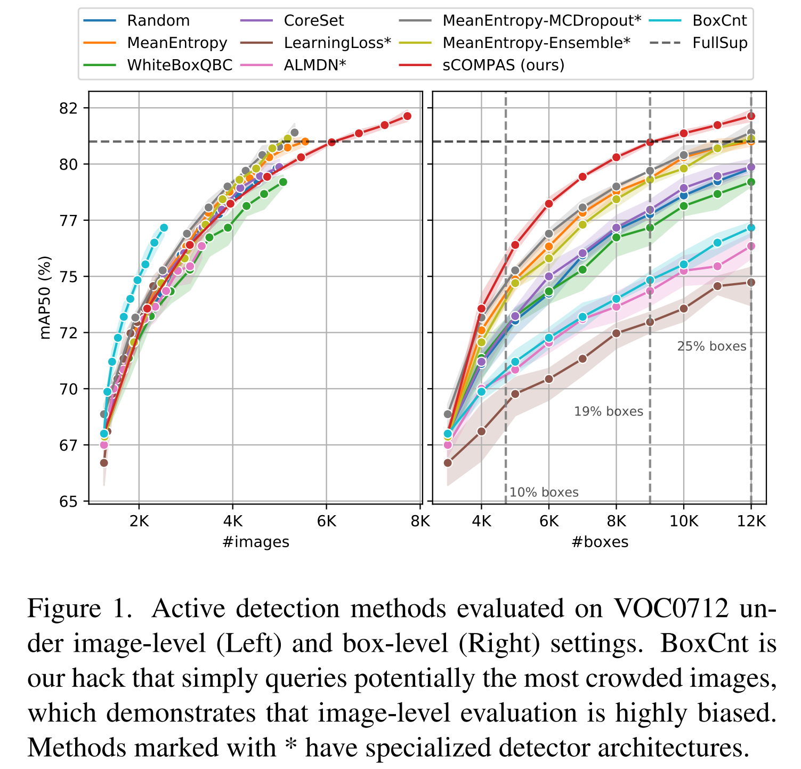

# Box-Level Active Detection (CVPR2023 highlight)
###  [[Project Website](https://lyumengyao.github.io/projects/blad)] | [[Paper](https://openaccess.thecvf.com/content/CVPR2023/html/Lyu_Box-Level_Active_Detection_CVPR_2023_paper.html)] <br>
 

<div align='center'>

</div>

## Introduction

This repo provides the official implementation of CVPR2023 paper ``Box-level Active Detection``, with a unified codebase for active learning for detection.

## Benchmark and model zoo

Supported datasets:

- [x] PASCAL VOC 0712
- [x] COCO Detection

Supported active learning methods:

- [x] [Random](configs/mining/faster_rcnn/augs/faster_rcnn_r50_fpn_1x_voc0712.py)
- [x] [MeanEntropy](configs/mining/faster_rcnn/augs/faster_rcnn_r50_fpn_1x_voc0712.py)
- [x] [WhiteBoxQBC](configs/mining/faster_rcnn/augs/faster_rcnn_r50_fpn_1x_voc0712_wbqbc.py)
- [x] [CoreSet](configs/mining/faster_rcnn/augs/faster_rcnn_r50_fpn_1x_voc0712_coreset.py)
- [x] [LearningLoss](configs/mining/faster_rcnn/augs/faster_rcnn_r50_fpn_1x_voc0712_learningloss.py)
- [x] [ALMDN](configs/mining/faster_rcnn/augs/faster_rcnn_r50_fpn_1x_voc0712_almdn.py)
- [x] [MeanEntropy-MCDropout](configs/mining/faster_rcnn/augs/faster_rcnn_r50_fpn_1x_voc0712_mcdropout.py)
- [x] [MeanEntropy-Ensemble](configs/mining/faster_rcnn/augs/faster_rcnn_r50_fpn_1x_voc0712.py)
- [x] [MIAOD](configs/mining/faster_rcnn/augs/faster_rcnn_r50_fpn_1x_voc0712_miaod.py)
- [x] [sCOMPAS (ours)](configs/mining/faster_rcnn/augs/faster_rcnn_r50_fpn_1x_voc0712_partial.py)
- [x] [mCOMPAS (ours)](configs/mining/faster_rcnn/augs/faster_rcnn_r50_fpn_1x_voc0712_mixed_2x.py)

## Usage

### Requirements
- `python=3.6`
- `Pytorch=1.9.1`
- `torchvision=0.10.1`
- `mmcv=1.3.9`
- `mmdetection=2.16.0`

### Installation
```
make install
```
And if you'd like to save the best checkpoint during training in mmdet 2.16, fix the Line 295 in mmcv/runner/hooks/evaluation.py as
```
runner.save_checkpoint(
                runner.work_dir, filename_tmpl=best_ckpt_name, create_symlink=False)
```
### Dataset
Datasets are placed in `data/detection/<dataset>`, otherwise the `data_root` variable in config files should be updated.

Note that we convert the annotations of PASCAL VOC into COCO format with the [dataset_converter](thirdparty/mmdetection/tools/dataset_converters/pascal_voc.py).

### Iterative Training and Evaluation
For example, run the following command for ComPAS on PASCAL VOC0712:
```
SEED=2022 QUERY_UNIT=box INIT_NUM=3000 ADD_NUM=1000 TRAIN_STEP=10 GPUS=4 bash dist_run_compas.sh voc0712 box_compas configs/mining/faster_rcnn/augs/faster_rcnn_r50_fpn_1x_voc0712_partial.py --deterministic
```
The results reported in the paper were conducted with seeds 2020, 2021, 2022.

## Citation

If this toolbox or benchmark is useful in your research, please cite this project.

```
@InProceedings{blad2023,
    author    = {Lyu, Mengyao and Zhou, Jundong and Chen, Hui and Huang, Yijie and Yu, Dongdong and Li, Yaqian and Guo, Yandong and Guo, Yuchen and Xiang, Liuyu and Ding, Guiguang},
    title     = {Box-Level Active Detection},
    booktitle = {Proceedings of the IEEE/CVF Conference on Computer Vision and Pattern Recognition (CVPR)},
    month     = {June},
    year      = {2023},
    pages     = {23766-23775}
}
```
